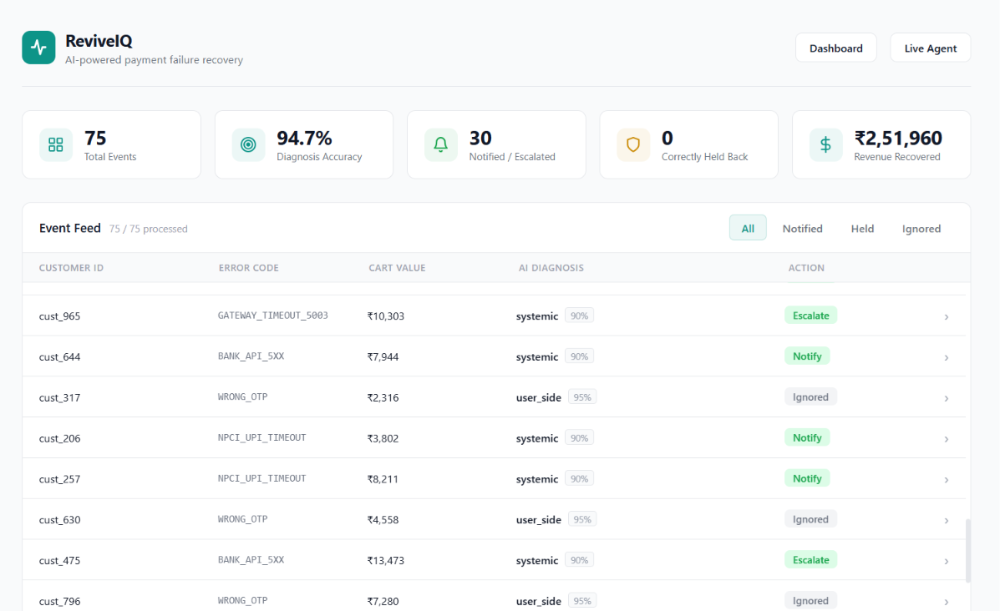
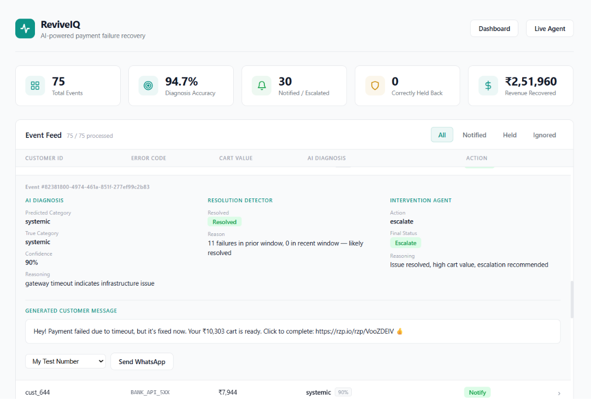
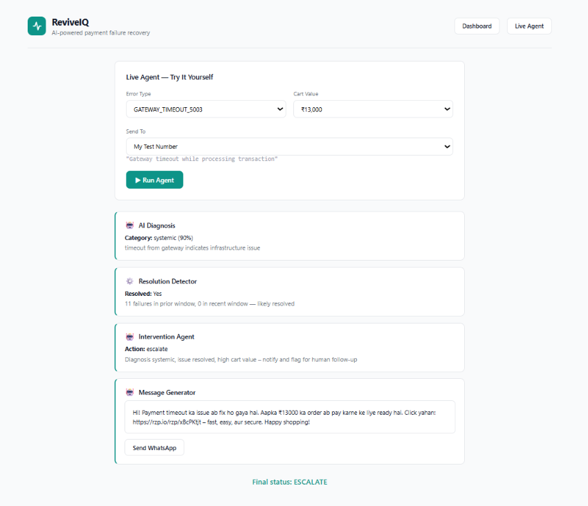
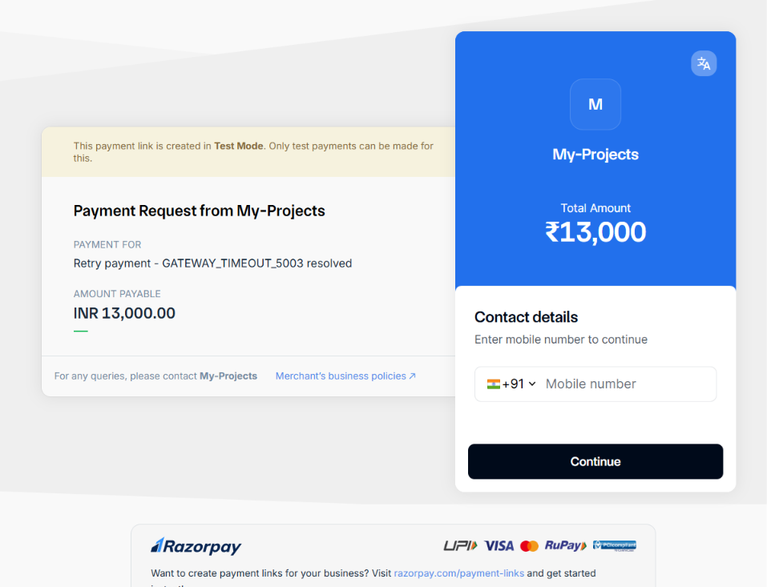
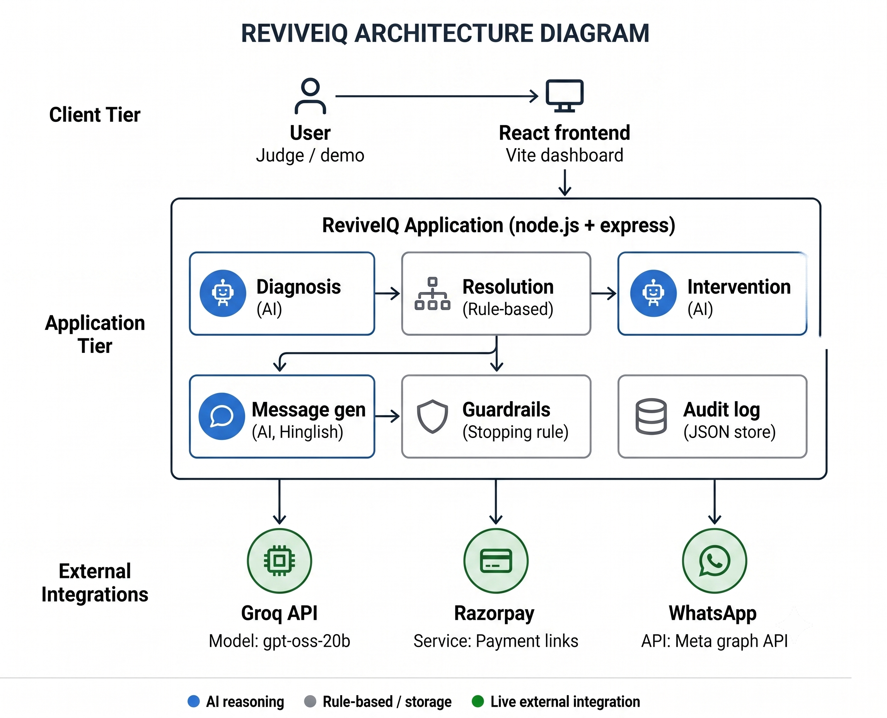

# ReviveIQ

AI-powered payment failure recovery agent — built for the Razorpay Buildathon, Track 03 (AI Revenue Recovery).

## The problem

Payments fail for reasons customers don't control — a gateway timeout, a bank API error, a temporary infrastructure issue. The failure gets fixed, but nobody tells the customer. They assume something is broken and abandon the purchase, even though their original intent to buy was real. This is silent, recoverable revenue loss.

Most recovery approaches message every drop-off indiscriminately. ReviveIQ does the opposite: it only reaches out when it has genuine reason to believe the customer's failure was systemic (not their fault) and that the underlying issue has actually been resolved. Everything else is deliberately left alone.

## What it does

1. **Diagnoses** a payment failure from its raw error message — is this systemic (our fault), user-side (their fault), or unclear?
2. **Checks** whether that systemic issue has actually stopped occurring, using a real rate-based signal over the event timeline.
3. **Decides** whether it's safe to reach out, and if so, whether to auto-notify or escalate to a human (based on cart value and confidence).
4. **Generates** a natural Hinglish recovery message, a real Razorpay retry link, and delivers it over WhatsApp.
5. **Logs** every decision at every stage, so the reasoning behind every action (and every non-action) is inspectable.


## User Interface


### UI Snaps





### Payment Page Snap



## Architecture



A failure event flows through the diagnosis agent, the resolution detector, and the intervention agent in sequence — with two deliberate exit points (Ignored, Held) where the agent does nothing rather than guess. Only a confidently-diagnosed, confidently-resolved, high-confidence case reaches message generation, Razorpay, and WhatsApp.

**Why AI is used where it is — and not everywhere:**

- **Diagnosis and intervention** use AI because they require judgment over messy, varied inputs (raw error strings, context-dependent tradeoffs like cart value vs. confidence) — a fixed rulebook can't do this robustly.
- **Resolution detection is deliberately rule-based** — a statistical comparison of failure rates before and after a time window. This is a case where a reliable, auditable signal beats an LLM guessing at statistics.
- **Message generation uses AI** to produce natural, localized (Hinglish) customer communication that a static template can't.

This split — AI for judgment, rules for reliability — is the core design decision behind the system, and it's why the two "restraint" branches (Ignored, Held) exist: the agent is built to do nothing rather than guess.

## Tech stack

- **Backend:** Node.js, Express
- **Frontend:** React (Vite) — a batch dashboard with a full audit trail, plus a "Live Agent" page to run the pipeline on demand and watch each stage reason in real time
- **AI:** Groq API (`openai/gpt-oss-20b`) — three focused calls: diagnosis, intervention, message generation
- **Payments:** Razorpay Payment Links API (test mode) — real, working retry links
- **Messaging:** WhatsApp Business Cloud API (Meta Graph API) — real message delivery, triggered from the dashboard
- **Data:** JSON-based synthetic dataset and audit log


## Results (batch of 75 synthetic events)


| Metric                                       | Value                                                                 |
| -------------------------------------------- | --------------------------------------------------------------------- |
| Diagnosis accuracy (vs. hidden ground truth) | 94.7%                                                                 |
| Notified / escalated                         | 30 events                                                             |
| Correctly ignored (user-side / unknown)      | 45 events                                                             |
| Estimated revenue recovered                  | ₹2,51,960                                                             |
| Real Razorpay retry links generated          | 25 of 30 (rest kept a safe placeholder after hitting API rate limits) |


The 45 "correctly ignored" events are the number that matters most: the agent never messages a customer whose failure wasn't systemic. That restraint is the actual product, not a side effect.

## How to run


### Backend

```bash
cd backend
npm install
# add your API keys to .env (Groq, Razorpay test keys, WhatsApp access token)
node server.js
```


### Frontend

```bash
cd frontend
npm install
npm run dev
```


### Regenerate synthetic data or rerun the batch

```bash
cd backend
npm run seed       # regenerates synthetic_events.json
node run_batch.js  # reprocesses all events, regenerates metrics + Razorpay links
```


## What's honestly out of scope

- WhatsApp delivery currently uses Meta's test-mode setup; a custom utility template with the full AI-generated message is pending Meta's review at time of submission (fallback: Meta's default template, still a real, working send).
- Contact details in the demo dataset are placeholders, not real customer records.
- SMS delivery is not wired to a live provider for this build.


## Team

Built by Vedant.